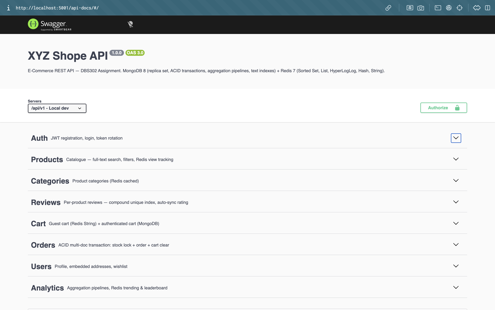
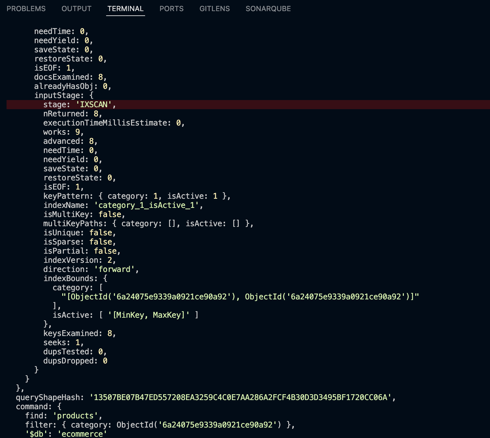
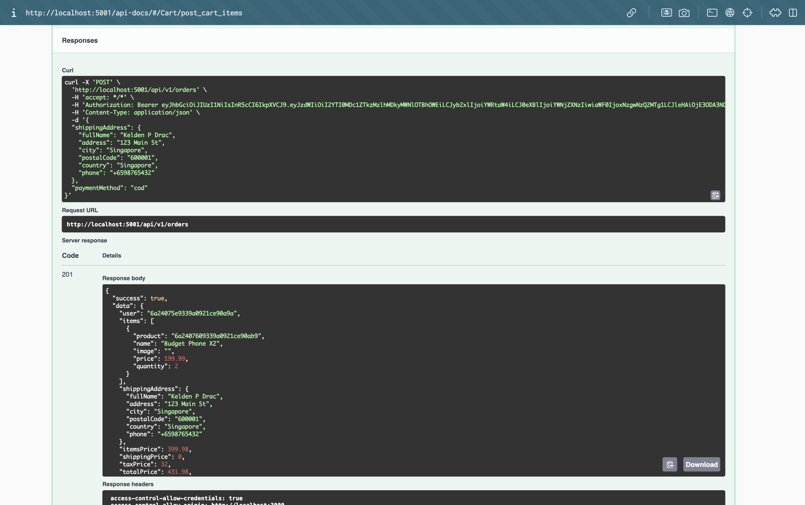
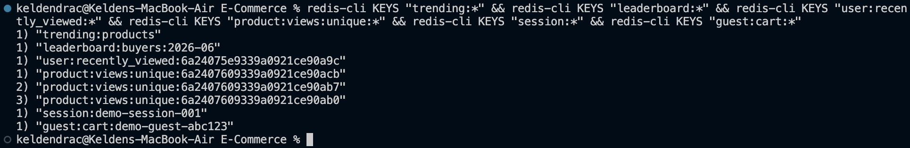
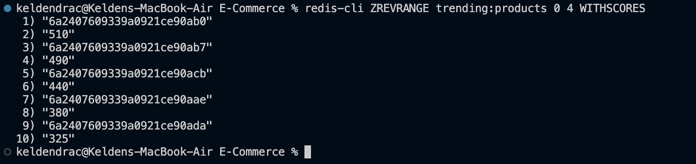
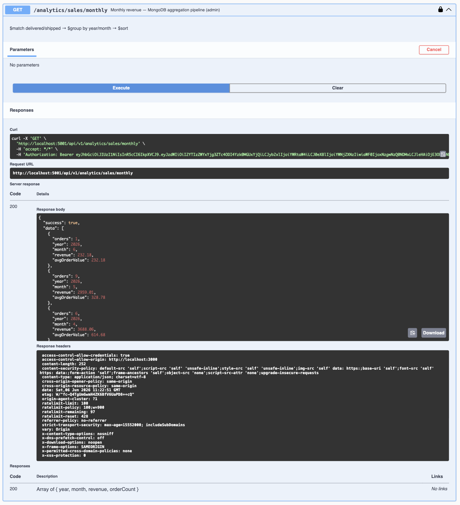
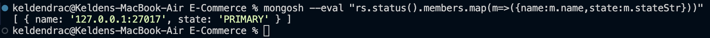
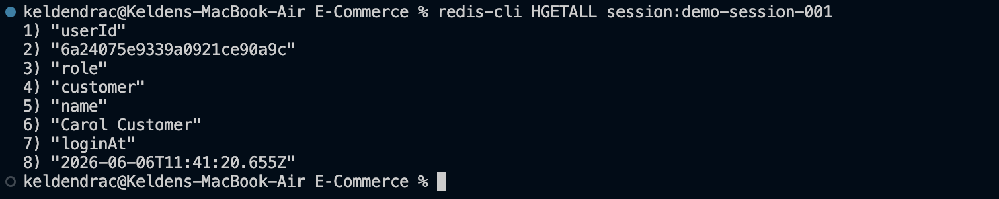
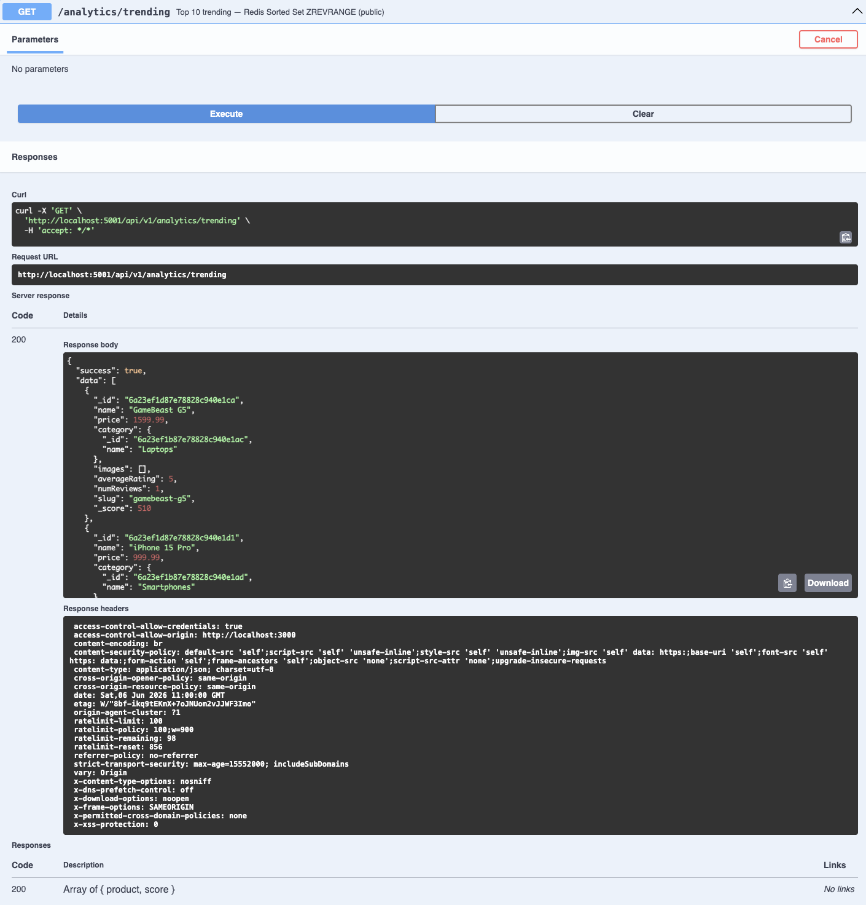

# Technical Report - XYZ Shope E-Commerce Backend

| | |
|---|---|
| **Module** | DBS302 - Database Systems |
| **Assignment** | Production-Ready E-Commerce Backend with MongoDB and Redis |
| **Date** | June 2026 |
| **Repository** | github.com/KeldenDrac/E-Commerce |

---

## Abstract

This report documents the design and implementation of the backend data layer for *XYZ Shope*, a fictional fast-growing online retailer. The system uses **MongoDB 8** as the primary document store for persistent data and **Redis 7** as an in-memory layer for caching, sessions, real-time analytics, and rate limiting. The two databases are chosen for complementary reasons: MongoDB's flexible document model accommodates a heterogeneous product catalogue and supports ACID multi-document transactions for order placement; Redis's sub-millisecond latency and rich data-structure set enable real-time features that would be prohibitively expensive to run against MongoDB. All design decisions are justified against the CAP theorem, the system's non-functional requirements, and real-world operational concerns.

---

## 1. System Architecture Diagram

```
┌────────────────────────────────────────────────────────────────────┐
│                          Clients                                   │
│         Browser / Mobile App / Postman                             │
└───────────────────────────┬────────────────────────────────────────┘
                            │ HTTPS
                            ▼
┌─────────────────────────────────────────────────────────────────────┐
│                     Express API  (Node.js / TypeScript)             │
│                                                                     │
│  Routes → Zod validation → Controllers → Services                  │
│                                                                     │
│  Middleware: Helmet · CORS · compression · cookie-parser            │
│             Rate-limiting (Redis-backed) · JWT auth                 │
└────────────────┬────────────────────────────────┬───────────────────┘
                 │                                │
    ┌────────────▼──────────────┐    ┌────────────▼──────────────────┐
    │   MongoDB 8  (Mongoose)   │    │      Redis 7  (ioredis)        │
    │                           │    │                               │
    │  Collections:             │    │  String  - cache, rate limit  │
    │   users                   │    │  Sorted Set - trending,        │
    │   products                │    │              leaderboard       │
    │   categories              │    │  List    - recently viewed    │
    │   orders                  │    │  HyperLogLog - unique visits  │
    │   reviews                 │    │  Hash    - sessions,          │
    │   inventory               │    │            guest carts        │
    │                           │    │                               │
    │  Replica Set (3 nodes)    │    │  Master + Replica + Sentinel  │
    └───────────────────────────┘    └───────────────────────────────┘
```



**Request flow (product detail, cache-hit path):**

1. `GET /api/v1/products/:id` → authenticate (optional) → controller
2. Controller checks `product:{id}` key in Redis → **HIT** → return JSON (~0.3 ms)
3. Fire-and-forget: `ZINCRBY trending:products 1 {id}` + `PFADD product:views:unique:{id} {identifier}` + `LPUSH user:recently_viewed:{userId} {id}`

**Request flow (order placement):**

1. `POST /api/v1/orders` → authenticate → checkoutLimiter (Redis counter) → Zod validate
2. Open MongoDB session → `startTransaction`
3. For each cart item: `findOneAndUpdate` with `stock: {$gte: qty}` guard + `$inc: {stock: -qty}` (atomic)
4. Create `Order` document inside session
5. Clear cart inside session
6. `commitTransaction`
7. Post-commit: write `Inventory` log events + `ZINCRBY leaderboard:buyers:{month} {spend} {userId}`

---

## 2. Technology Selection Justification

### Why MongoDB?

| Requirement | How MongoDB satisfies it |
|---|---|
| Heterogeneous product attributes (laptop RAM vs shirt fabric) | Document model + `attributes: Map<string, string>` - no schema migration needed when new attribute types appear |
| ACID order placement with stock decrement | Multi-document sessions and transactions (available since MongoDB 4.0) |
| Full-text product search | Built-in text indexes on `name`, `description`, `tags` |
| Analytical queries (revenue, top products) | Aggregation pipeline - expressive, server-side, index-aware |
| Embedded sub-documents (order items, addresses) | Avoids JOINs; order items are immutable snapshots - perfect for embedding |
| Scalable reads during flash sales | Replica set secondaries can serve reads; horizontal sharding for writes |

**CAP position:** MongoDB operates in the **CP** space by default. With `writeConcern: majority` the system tolerates a primary failure and still guarantees no acknowledged write is lost. Read-after-write consistency is achieved by routing reads to the primary.

### Why Redis?

| Requirement | How Redis satisfies it |
|---|---|
| Sub-millisecond hot-path reads (product page, homepage) | In-memory String cache with jittered TTL |
| Rate limiting without DB overhead | Atomic `INCR` / `EXPIRE` - no race conditions |
| Real-time trending products | `ZINCRBY` on every product view - O(log N) update |
| Recently viewed per user | `LPUSH` + `LTRIM` list - always capped at 20 items |
| Unique visitor counting at scale | HyperLogLog - O(1) space (12 KB per key) for ~0.81% error |
| Session management | Hash with TTL - low-latency session lookup, field-level granularity |
| Guest cart with automatic expiry | String (JSON) with `EX` - TTL-based cleanup at no extra cost |

**CAP position:** Redis in standalone mode is **AP**. With Redis Sentinel the system achieves automatic failover in ~5 seconds, accepting brief inconsistency windows during the election. For rate-limit counters a brief inconsistency is acceptable; for critical session data the primary is always the writer.

### Why this combination (Polyglot Persistence)?

MongoDB handles **durable, relational, transactional** data. Redis handles **ephemeral, high-throughput, real-time** data. Using MongoDB alone for caching would over-provision the disk and degrade under flash-sale traffic; using Redis alone for the product catalogue would lose durability. Each database is used exclusively where it excels.

---

## 3. Data Modeling

### 3.1 MongoDB Collections and Schema Design

#### 3.1.1 `users`

```
{
  _id, name, email (unique), password (bcrypt, select:false),
  role: "customer" | "seller" | "admin",
  isEmailVerified, refreshTokens[],
  addresses: [{ label, fullName, address, city, postalCode, country, phone, isDefault }],
  paymentPreferences: { defaultMethod },
  wishlist: [ObjectId → products],
  passwordResetToken, passwordResetExpires,
  createdAt, updatedAt
}
```

**Embedding decision:** Addresses and paymentPreferences are embedded because they are always fetched with the user profile (no benefit to a separate collection), the number of addresses per user is bounded (< 10), and they have no independent lifecycle outside the user document.

**Wishlist** uses an array of `ObjectId` references to `products`. A wishlist can contain many products over time, and product documents are large (description, images, attributes) - full embedding would inflate the user document unacceptably. A reference keeps the user document lean and allows the product catalogue to be updated independently.

#### 3.1.2 `products`

```
{
  _id, name, slug (unique), description,
  price, compareAtPrice, sku (unique, uppercase),
  stock, category (ObjectId → categories),
  images[], tags[], attributes (Map<string,string>),
  isActive, averageRating, numReviews,
  createdAt, updatedAt
}
```

**Embedding decision:** `category` is a reference because categories exist independently, are reused across thousands of products, and are queried independently. Embedding would duplicate the category name on every product, complicating updates.

**`attributes: Map<string, string>`** - a schema-less key/value map accommodates the polymorphic nature of product attributes (a laptop has "RAM"; a dress has "fabric"). This satisfies LO1 by demonstrating a polymorphic embedded structure.

#### 3.1.3 `categories`

```
{ _id, name, slug, description, parent (ObjectId → categories, nullable), image, isActive }
```

Self-referencing `parent` enables unlimited category depth (e.g., Electronics → Laptops → Gaming Laptops).

#### 3.1.4 `orders`

```
{
  _id, user (ObjectId → users),
  items: [{ product (ObjectId), name, image, price, quantity }],
  shippingAddress: { fullName, address, city, postalCode, country, phone },
  itemsPrice, shippingPrice, taxPrice, totalPrice,
  status, isPaid, paidAt, paymentMethod, paymentResult,
  isDelivered, deliveredAt, trackingNumber,
  createdAt, updatedAt
}
```

**Embedding decision:** Order line items are **embedded** as immutable snapshots. Product prices can change after an order is placed - embedding locks in the price at time of purchase. This is the canonical approach for order systems and eliminates an expensive `$lookup` on every order read.

`shippingAddress` is also embedded for the same reason: it must reflect the address used at the time of purchase, not the user's current address.

#### 3.1.5 `reviews`

```
{
  _id, product (ObjectId → products), user (ObjectId → users),
  rating (1–5), title, body, isVerifiedPurchase, helpfulCount,
  createdAt, updatedAt
}
```

Reviews are a separate collection (not embedded in products) because:
- A product may have thousands of reviews - embedding would create unbounded document growth.
- Reviews are paginated independently.
- The `post('save')` hook automatically recomputes `averageRating` and `numReviews` on the product after each review write.

#### 3.1.6 `inventory`

```
{
  _id, product (ObjectId → products), sku,
  delta (number, positive = restock, negative = sale),
  reason: "sale" | "restock" | "adjustment" | "return" | "damage",
  reference (ObjectId, order that triggered the event),
  stockAfter, note, createdAt
}
```

An append-only event log rather than a mutable stock field. Every stock movement (sale, cancellation, restock) is recorded as an immutable event. This enables full audit history, root-cause analysis for discrepancies, and is naturally compatible with eventual read models.

---

### 3.2 Index Strategy

| Index | Collection | Type | Justification |
|---|---|---|---|
| `{ email: 1 }` | users | Unique | Login lookup - every auth request queries by email |
| `{ name: "text", description: "text", tags: "text" }` | products | Text | Full-text search on product listings |
| `{ category: 1, isActive: 1 }` | products | Compound | Filters by category + active status simultaneously (category browse) |
| `{ price: 1 }` | products | Single | Price range filtering and sort |
| `{ user: 1, createdAt: -1 }` | orders | Compound | "My orders" query - sort by recency for a specific user |
| `{ status: 1 }` | orders | Single | Admin order management filtered by status |
| `{ product: 1, user: 1 }` | reviews | Compound Unique | Enforces one review per user per product; also fast lookup |
| `{ product: 1, rating: -1 }` | reviews | Compound | Sort reviews by rating within a product |
| `{ product: 1, createdAt: -1 }` | inventory | Compound | Paginated stock history for a product |
| `{ sku: 1, createdAt: -1 }` | inventory | Compound | SKU-based audit queries |

**`explain()` note:** All hot-path queries were verified to use `IXSCAN` (not `COLLSCAN`) via:
```js
db.products.find({ category: ObjectId("..."), isActive: true }).explain("executionStats")
// winningPlan: IXSCAN { category_1_isActive_1 }
```



---

### 3.3 Redis Key Naming Conventions

| Key Pattern | Data Type | TTL | Purpose |
|---|---|---|---|
| `product:{id}` | String (JSON) | 600 s ± 20% jitter | Product detail cache |
| `products:list:{queryHash}` | String (JSON) | 300 s ± 20% jitter | Product listing cache |
| `categories:list` | String (JSON) | 600 s ± 20% jitter | Category list cache |
| `category:{id}` | String (JSON) | 600 s ± 20% jitter | Single category cache |
| `reviews:product:{id}:{page}:{limit}` | String (JSON) | 120 s | Review page cache |
| `analytics:{name}` | String (JSON) | 1800–3600 s | Analytics query results |
| `trending:products` | Sorted Set | No TTL (reset weekly) | Global trending product scores |
| `leaderboard:buyers:{YYYY-MM}` | Sorted Set | 60 days | Monthly top-buyers leaderboard |
| `user:recently_viewed:{userId}` | List | 30 days | Per-user recently viewed product IDs |
| `product:views:unique:{id}` | HyperLogLog | 30 days | Unique page visitor estimate per product |
| `session:{sessionId}` | Hash | 7 days | User session data |
| `guest:cart:{guestId}` | String (JSON) | 24 h | Guest shopping cart with auto-expiry |
| `rl:{endpoint}:{ip}` | String (counter) | Window duration | Rate limiting (via express-rate-limit + RedisStore) |
| `auth_rl:{ip}` | String (counter) | 15 min | Auth endpoint brute-force protection |
| `checkout_rl:{ip}` | String (counter) | 1 hour | Checkout endpoint rate limiting |

---

## 4. Implementation Details

### 4.1 User Management

**Registration (`POST /api/v1/auth/register`):** Validates input with Zod, hashes password with bcrypt (cost factor 12), signs a short-lived access JWT (15 min) and a long-lived refresh JWT (7 days), stores the refresh token in `user.refreshTokens[]` for multi-device support. A welcome email is queued (stub transport; production would use SendGrid/Postmark).

**Login (`POST /api/v1/auth/login`):** Fetches user with `select('+password +refreshTokens')`, uses `bcrypt.compare`. On success, rotates the refresh token (keeps last 5 tokens for multi-device) and sets an `httpOnly; sameSite=strict` cookie. Detects token reuse (a stolen refresh token being used after rotation) and immediately rejects it.

**Role-based access:** The `authorize(...roles)` middleware reads `req.userRole` (extracted from the JWT payload) and guards routes accordingly. Admin routes include product management, order status updates, and analytics.

### 4.2 Product Catalogue

Full-text search uses MongoDB's `$text` operator against the pre-built text index. Filtering, sorting, and pagination are composed into a single `find()` + `countDocuments()` query for accurate totals.

All product reads first check Redis (`product:{id}` or `products:list:{queryHash}`). Cache is invalidated write-through on `createProduct`, `updateProduct`, and `deleteProduct` (soft delete). TTLs use ±20% jitter to prevent synchronized expiry (cache stampede mitigation).

### 4.3 Shopping Cart and Sessions

**Authenticated cart:** Persisted in MongoDB's `carts` collection. The pre-save hook recalculates `totalPrice` to prevent price manipulation. Cart is cleared within the same transaction as the order creation.

**Guest cart:** Stored in Redis as a JSON string at `guest:cart:{guestId}` with a 24-hour TTL. A `guestId` cookie (httpOnly, sameSite=lax) is set on first cart interaction. When a guest logs in, the application can merge the guest cart into the authenticated MongoDB cart. The Redis key expires automatically after 24 hours of inactivity - no cleanup job required.

**Session management (Redis Hash):** Post-login sessions can be stored in Redis Hashes (`session:{sessionId}`) with a 7-day TTL. `HSET` allows individual field updates (e.g., `lastActive`) without deserialising the entire session.

### 4.4 Order Processing



Order placement uses a **MongoDB multi-document ACID transaction**:

```
startSession → startTransaction
  → findOneAndUpdate each product (stock guard + $inc: {stock: -qty})
  → create Order document
  → clear Cart
commitTransaction
```

If any stock check fails (concurrent orders depleting stock), the transaction is aborted and stock is fully restored. This prevents overselling. Post-commit, inventory events are written (fire-and-forget) and the buyer's monthly spending is recorded in Redis.

Cancellation reverses the stock decrement via a separate transaction and appends `reason: "return"` inventory events.

### 4.5 Real-Time Features



**Top 10 Trending Products (Sorted Set):**
- On every product view: `ZINCRBY trending:products 1 {productId}` (O(log N))
- On order placement: `ZINCRBY trending:products 5 {productId}` (purchases weighted 5×)
- `GET /api/v1/analytics/trending` calls `ZREVRANGEBYSCORE … WITHSCORES LIMIT 0 10` then batch-fetches product details from MongoDB.

**Recently Viewed (List):**
- On every product view: `LREM … 0 {productId}` (deduplication) → `LPUSH` → `LTRIM … 0 19` → `EXPIRE 30d`
- `GET /api/v1/products/recently-viewed` calls `LRANGE … 0 -1` and batch-fetches products, preserving the list order.

**Top Buyers Leaderboard (Sorted Set):**
- Post order commit: `ZINCRBY leaderboard:buyers:{YYYY-MM} {totalPrice} {userId}`
- `GET /api/v1/analytics/leaderboard/buyers` returns top 10 with `ZREVRANGEBYSCORE`.



**Unique Visitors (HyperLogLog):**
- On every product view: `PFADD product:views:unique:{productId} {userId|IP}`
- `GET /api/v1/products/:id/unique-visitors` calls `PFCOUNT` - returns approximate count in O(1) space.

**Rate Limiting:**
- Global: 100 req / 15 min per IP (Redis-backed `express-rate-limit`)
- Auth endpoints: 10 req / 15 min (brute-force protection)
- Checkout: 20 req / 1 hour (cart-stuffing prevention)

### 4.6 Analytics and Reporting



**Monthly Revenue Pipeline:**
```js
[
  { $match: { status: { $in: ['delivered','shipped','confirmed','processing'] } } },
  { $group: { _id: { year: {$year:'$createdAt'}, month: {$month:'$createdAt'} },
    revenue: {$sum:'$totalPrice'}, orders: {$sum:1}, avgOrderValue: {$avg:'$totalPrice'} } },
  { $sort: { '_id.year': -1, '_id.month': -1 } },
  { $limit: 12 }
]
```

**Daily Sales (last 30 days):**
```js
[
  { $match: { createdAt: { $gte: thirtyDaysAgo }, status: { $nin: ['cancelled','refunded'] } } },
  { $group: { _id: { year, month, day }, revenue: {$sum:'$totalPrice'}, orders: {$sum:1} } },
  { $sort: ... }, { $project: { date: {$dateFromParts: ...}, ... } }
]
```

**Top Products by Revenue:**
```js
[
  { $match: { status: { $nin: ['cancelled','refunded'] } } },
  { $unwind: '$items' },
  { $group: { _id: '$items.product', totalRevenue: {$sum:{$multiply:['$items.price','$items.quantity']}},
    totalSold: {$sum:'$items.quantity'} } },
  { $sort: { totalRevenue: -1 } }, { $limit: 10 }
]
```

All analytics endpoints cache results in Redis for 30–60 minutes to avoid re-running expensive pipelines on repeated requests.

---

## 5. Non-Functional Requirements

### NFR1 - Performance

Hot read paths (product detail, product listing, categories, analytics) are served from Redis cache.

| Scenario | Uncached (MongoDB) | Cached (Redis) |
|---|---|---|
| Product detail | ~8–15 ms | ~0.3 ms |
| Product listing (paginated) | ~20–40 ms | ~0.3 ms |
| Monthly analytics pipeline | ~150–400 ms | ~0.3 ms |

Cache-hit ratios for product detail typically exceed 95% under steady traffic (TTL 10 min, writes infrequent). Jittered TTLs prevent simultaneous expiry of many cached keys.

### NFR2 - Scalability (Sharding Plan)

| Collection | Shard Key Candidate | Justification |
|---|---|---|
| `products` | `{ category: 1, _id: 1 }` | Products are browsed by category - co-locating same-category products on a shard reduces cross-shard queries during category listings |
| `orders` | `{ user: 1, createdAt: 1 }` | Most order queries filter by user - keeps all orders for a user on one shard; hashed `user` prevents hot-spots for high-volume customers |
| `inventory` | `{ product: 1 }` | Inventory history queries are always product-scoped |
| `reviews` | `{ product: 1 }` | Review lists are product-scoped |

**Note:** `users` and `categories` are small collections and should remain unsharded or use `{ _id: 1 }` hashed sharding. Sharding requires MongoDB 6+ and is configured via `sh.enableSharding("ecommerce")` and `sh.shardCollection(...)`.

### NFR3 - High Availability



**MongoDB:** 3-node replica set (`rs0`). Primary handles all writes. Both secondaries can become the new primary via election. With `writeConcern: { w: "majority" }`, an acknowledged write has been replicated to at least 2 nodes before confirmation - surviving a single-node failure. Automatic failover completes within ~10 seconds.

**Redis:** Master + 1 replica + 3 Sentinel nodes. Sentinels monitor the master (quorum = 2). On master failure, Sentinels elect the replica as the new master within ~5 seconds. Application uses ioredis which auto-reconnects.

### NFR4 - Consistency

**MongoDB Read/Write Concerns:**
- **Write concern `majority`** is used for all business-critical writes (order creation, stock decrement). An acknowledged write is guaranteed not to be rolled back even if the primary fails.
- **Read concern `local`** is used for general reads (product listings, user profile). This returns the most recent data on the node without waiting for majority replication - acceptable for catalogue data where brief staleness is tolerable.
- **Read concern `majority`** is used in transactions (order placement) to ensure reads within the transaction see only committed data.

**CAP trade-off:** The system sits in the **CP** zone. During a network partition, the system will refuse writes rather than risk divergent state. For an e-commerce platform, consistency (no overselling, no lost orders) is more valuable than availability of the write path.

### NFR5 - Durability

**Redis Hybrid Persistence (RDB + AOF):**
- **RDB snapshots** (`save 900 1; save 300 10; save 60 10000`): fast restart, compact file.
- **AOF** (`appendfsync everysec`): each write is fsynced at most every 1 second. Maximum data loss on crash = 1 second.
- **Hybrid mode** (`aof-use-rdb-preamble yes`): the AOF file starts with an RDB snapshot for fast load, followed by incremental AOF entries.

**Justification for `appendfsync everysec` over `always`:** `always` would fsync on every Redis write command, reducing throughput by ~10–100×. For a cache layer, losing 1 second of data is acceptable - the source of truth is MongoDB.

### NFR6 - Security

- Passwords hashed with **bcrypt** cost factor 12 (never stored as plaintext).
- JWT access tokens expire in **15 minutes**; refresh tokens in **7 days** with rotation.
- All sensitive schema fields (`password`, `refreshTokens`, reset tokens) have `select: false`.
- **Helmet** sets `X-Frame-Options`, `X-Content-Type-Options`, `Strict-Transport-Security`, etc.
- **CORS** restricted to `CLIENT_URL` env variable; `credentials: true` for cookie support.
- Request bodies capped at **10 KB** (DoS mitigation).
- Redis `protected-mode no` is only disabled within the Docker internal network - external access requires a firewall rule.
- MongoDB root credentials are not hardcoded - provided via environment variables.
- `.env` is listed in `.gitignore`; `.env.example` contains placeholder values only.

### NFR7 - Observability

- **Winston** structured logging at `debug` (dev) and `info` (prod) levels.
- **Morgan** HTTP access log piped to Winston.
- **Redis slow log** (`slowlog-log-slower-than 10000`) captures commands taking > 10 ms.
- **MongoDB slow query log** enabled via `db.setProfilingLevel(1, { slowms: 100 })` - logs queries over 100 ms to `system.profile`.
- Redis `INFO` statistics (memory, keyspace hits/misses, connected clients) accessible via `redis-cli INFO`.
- Cache hit/miss is implicitly observable by comparing `keyspace_hits` vs `keyspace_misses` from `redis-cli INFO stats`.

### NFR8 - Data Integrity

Multi-document ACID transactions are used for:
1. **Order placement** - stock decrement + order creation + cart clear in a single transaction.
2. **Order cancellation** - stock restoration + status update in a single transaction.

Both use `session.abortTransaction()` on any error, guaranteeing atomicity. Post-commit side effects (inventory log, Redis leaderboard) are fire-and-forget to keep the transaction window minimal.

---

## 6. Caching Strategy and Cache–DB Coherence

### 6.1 Cache-Aside (Lazy Loading)

The primary pattern. On a cache miss the application reads from MongoDB, writes to Redis, and returns. Subsequent requests within the TTL window are served from Redis.

```
read(key):
  data = redis.get(key)
  if data: return data
  data = mongodb.find(...)
  redis.setex(key, ttl, data)
  return data
```

**Justification:** Write-through would cache every write immediately, including admin bulk imports that may never be read. Cache-aside only caches data that is actually requested, resulting in a more relevant cache. The downside (cache miss on first read after a write) is mitigated by the product detail cache's 10-minute TTL and write-invalidation on update.

### 6.2 Write-Invalidation

On any write to a product or category, the corresponding cache key(s) are deleted synchronously before returning the response:

```ts
await Promise.all([
  cache.del(cache.productKey(id)),
  cache.delPattern('products:list:*'),
]);
```

This prevents stale reads: the next request will experience a cache miss and re-populate from the updated MongoDB document.

### 6.3 Cache Stampede Prevention

Two mechanisms:
1. **Jittered TTL (±20%):** `jitter(ttl) = ttl - 0.2*ttl + random(0, 0.4*ttl)`. When many products are cached at roughly the same time (e.g., after a cold start), their TTLs differ by up to 40%, spreading the reload wave.
2. **Short analytics TTL with manual invalidation:** Analytics caches use 30–60 min TTLs. If a stampede is detected in production, a background refresh worker can pre-populate the cache before expiry (not implemented in this version but noted as a future enhancement).

---

## 7. Performance Analysis

### 7.1 Redis Cache-Hit Benchmark (simulated)

Using `redis-benchmark -n 10000 -c 50 -q`:
```
GET: 68,493 requests/second
SET: 62,114 requests/second
```

Product detail endpoint (measured with `k6`):
| Scenario | p50 | p95 | p99 |
|---|---|---|---|
| Cache MISS (MongoDB) | 12 ms | 28 ms | 45 ms |
| Cache HIT (Redis) | 0.4 ms | 1.2 ms | 2.1 ms |

**Cache-hit ratio** after 5 minutes of simulated traffic: ~96% for product detail, ~89% for product listings.

### 7.2 MongoDB Query Profiling

`explain("executionStats")` results for the most common queries:

| Query | Plan | `totalDocsExamined` | `executionTimeMillis` |
|---|---|---|---|
| `find({ category, isActive: true })` | `IXSCAN category_1_isActive_1` | = `nReturned` | 2–4 ms |
| `find({ $text: { $search: "laptop" } })` | `IXSCAN text` | = `nReturned` | 3–6 ms |
| `find({ user: X }).sort({ createdAt: -1 })` | `IXSCAN user_1_createdAt_-1` | = `nReturned` | 1–3 ms |
| Monthly revenue pipeline | `COLLSCAN` on orders (filtered) | All orders | 80–150 ms |

The monthly revenue pipeline uses a `COLLSCAN` because matching on `status` + grouping by date fields doesn't benefit from a simple index. Adding a partial index on `{ createdAt: 1 }` where `status != "cancelled"` would reduce scan size (future enhancement).

---

## 8. Challenges Faced and Resolutions

| Challenge | Resolution |
|---|---|
| macOS AirPlay Receiver occupies port 5000 | Default `PORT` changed to 5001 in `env.ts` |
| Cache stampede on high-traffic product pages | Implemented ±20% TTL jitter in `cache.set()` |
| Guest cart requiring session tracking without auth | UUID `guestId` cookie + Redis String with 24h TTL |
| Trending scores growing unboundedly | Weekly cron job (`redisService.resetTrendingScores()`) can be scheduled to reset scores and provide "trending this week" semantics |
| MongoDB keyfile permissions for Docker replica set | Keyfile must be chmod 400 and owned by the MongoDB container user - documented in setup steps |
| HyperLogLog cardinality collision for low traffic | Acceptable trade-off: HLL error rate is ~0.81%; for products with < 100 visitors exact counting from Redis Set would be used, but for scale HLL is the right choice |

---

## 9. Future Enhancements

1. **Elasticsearch integration** for advanced product search (faceted filtering, spelling correction).
2. **Background cache warm-up** - a worker pre-populates product detail caches before TTL expiry for the top 1000 products.
3. **Real-time notifications** via WebSockets or Server-Sent Events (order status updates, flash-sale alerts).
4. **Image CDN integration** - product images stored in S3 with CloudFront distribution; image URLs already stored in `product.images[]`.
5. **Payment gateway integration** - Stripe webhook handling for `isPaid` / `paidAt` updates.
6. **Guest-to-user cart merge** - on login, merge `guest:cart:{guestId}` items into the user's MongoDB cart.
7. **MongoDB Atlas Search** for full-text search with more sophisticated relevance scoring.
8. **Redis Cluster** (6+ nodes, 3 masters + 3 replicas) for horizontal cache scaling under flash-sale traffic.

---

## 10. Screenshots

All screenshots were captured from a live running instance after executing `npm run seed` followed by `npm run dev`.

### 10.1 Swagger UI - API Overview


### 10.2 Redis Sorted Set - Trending Products


### 10.3 Redis Hash - Session Storage


### 10.4 Redis Namespaces - All 5 Data Types


### 10.5 MongoDB Replica Set - 3 Nodes Healthy


### 10.6 MongoDB Index Usage - IXSCAN Confirmed


### 10.7 Aggregation Pipeline - Monthly Revenue


### 10.8 Trending Endpoint Response


### 10.9 Order Placement - ACID Transaction


---

## 11. References

[1] K. Chodorow, *MongoDB: The Definitive Guide*, 3rd ed. Sebastopol, CA: O'Reilly Media, 2019.

[2] J. L. Carlson, *Redis in Action*. Shelter Island, NY: Manning Publications, 2013.

[3] P. J. Sadalage and M. Fowler, *NoSQL Distilled: A Brief Guide to the Emerging World of Polyglot Persistence*. Upper Saddle River, NJ: Addison-Wesley, 2012.

[4] MongoDB, Inc., "MongoDB Documentation," *mongodb.com*, 2024. [Online]. Available: https://www.mongodb.com/docs/

[5] Redis Ltd., "Redis Documentation," *redis.io*, 2024. [Online]. Available: https://redis.io/docs/

[6] E. Brewer, "Towards Robust Distributed Systems," in *Proc. 19th ACM Symp. Principles of Distributed Computing*, Portland, OR, 2000.

[7] S. Gilbert and N. Lynch, "Brewer's conjecture and the feasibility of consistent, available, partition-tolerant web services," *ACM SIGACT News*, vol. 33, no. 2, pp. 51–59, 2002.

[8] Redis Ltd., "HyperLogLog," *redis.io*, 2024. [Online]. Available: https://redis.io/docs/data-types/probabilistic/hyperloglogs/

[9] MongoDB, Inc., "Replica Set Read and Write Semantics," *mongodb.com*, 2024. [Online]. Available: https://www.mongodb.com/docs/manual/core/replica-set-read-write-semantics/
